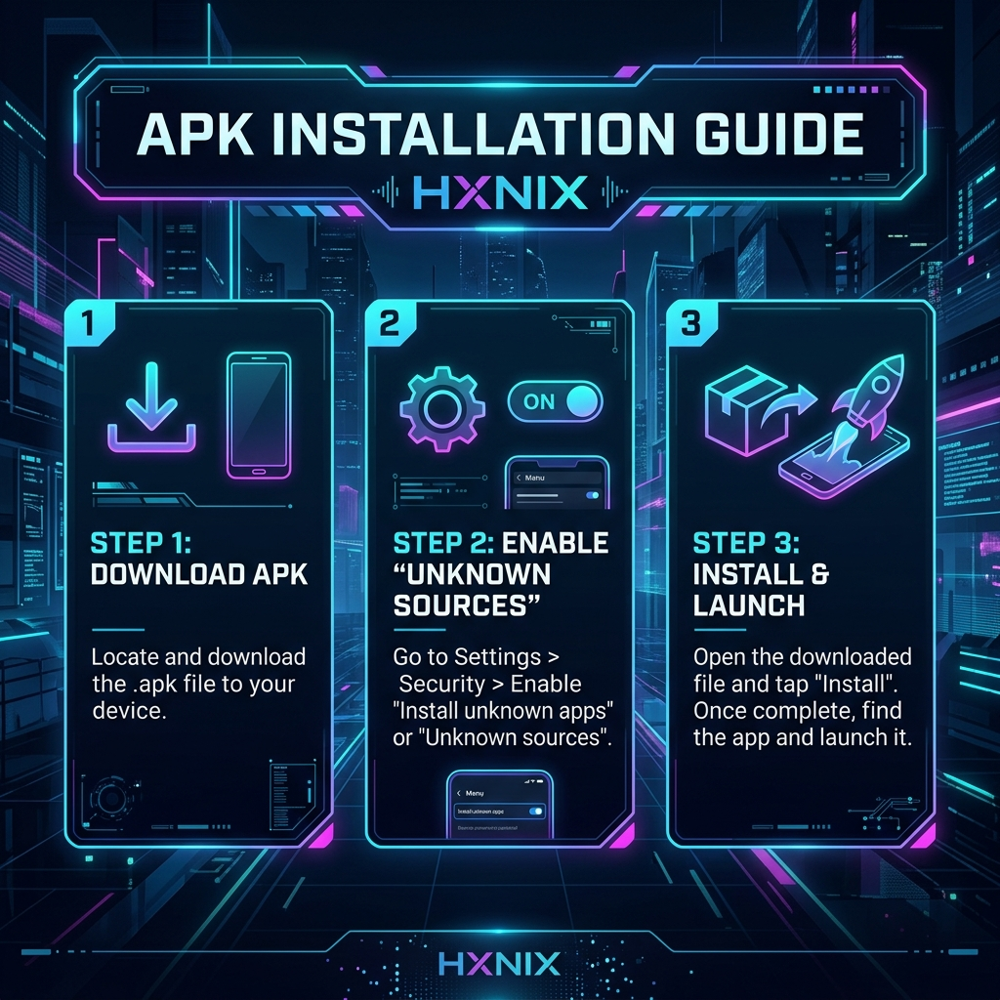

# HXNIX - Industrial Social Feed App

React Native (Expo SDK 54) + Node.js + Express + MySQL.

---

## ⚡ ACCESS THE GRID: Standalone APK (v1.0.3)

| 1. Scan / Click to Download | 2. Installation Guide |
| :-------: | :-------: |
|  |  |
| [**DIRECT_DOWNLOAD_LINK**](https://expo.dev/artifacts/eas/iWXWVNG9ZvfjQ6QPMAeZoR.apk) | *Enable "Unknown Sources" in settings* |


> [!TIP]
> **PRO-TIP:** For the fastest installation, scan the QR code above with your mobile phone's camera. This version is **standalone** and does not require a local backend server to be running.

---

## Architecture

```text
Expo Go App (React Native / Expo SDK 54)
          -> Axios REST API
Node.js + Express (port 5000)
          -> MySQL
Database: hxnix_db
```

---

## Prerequisites

| Tool | Version |
|------|---------|
| Node.js | 18+ |
| npm | 9+ |
| MySQL | 8.0+ |
| Expo Go | Latest (SDK 54 compatible) |

---

## Quick Start (from zero)

### 1) Create database

Run in MySQL:

```sql
CREATE DATABASE IF NOT EXISTS hxnix_db
  CHARACTER SET utf8mb4
  COLLATE utf8mb4_unicode_ci;
```

The backend auto-creates the `posts` table and seeds initial data when table is empty.

### 2) Configure backend

Go to backend folder and install dependencies:

```bash
cd backend
npm install
```

Create/update `backend/.env`:

```env
PORT=5000
DB_HOST=localhost
DB_PORT=3306
DB_USER=root
DB_PASSWORD=YOUR_MYSQL_PASSWORD
DB_NAME=hxnix_db
```

Start backend:

```bash
# dev
npm run dev

# or production
# npm start
```

Expected backend logs:

```text
[DB] MySQL connected successfully
[Model] Posts table seeded with 7 records   # only if table empty
Hxnix API running on http://0.0.0.0:5000
```

### 3) Configure frontend API URL

Find your machine LAN IP:

```bash
# Windows
ipconfig
```

Edit `frontend/src/config.js`:

```js
export const API_BASE_URL = 'http://YOUR_LAN_IP:5000';
```

Important: physical phone + Expo Go cannot use `localhost`.

### 4) Install and run frontend

```bash
cd frontend
npm install
npx expo start --lan -c
```

Open in Expo Go:

- Scan QR from terminal, or
- Manual URL format:

```text
exp://YOUR_LAN_IP:8081
```

---

## Verify Everything Works

Backend checks:

- `http://localhost:5000/health`
- `http://localhost:5000/api/posts`
- `http://localhost:5000/api/posts/1`

Expected:

- Health returns `{"status":"ok", ...}`
- Posts returns `success: true` and list of posts

---

## API Reference

| Method | Endpoint | Description |
|--------|----------|-------------|
| GET | `/health` | Server health |
| GET | `/api/posts` | Get all posts |
| GET | `/api/posts/:id` | Get one post |
| POST | `/api/posts` | Create post |
| DELETE | `/api/posts/:id` | Delete post |

POST request body:

```json
{
  "title": "My Post Title",
  "body": "Full post content",
  "userId": 1
}
```

---

## Common Issues and Fixes

### 1) MySQL access denied

Error:

```text
Access denied for user 'root'@'localhost'
```

Fix:

- Check `DB_USER` and `DB_PASSWORD` in `backend/.env`
- Ensure MySQL service is running

### 2) Unknown database `hxnix_db`

Fix: run the SQL create database command from this README.

### 3) Expo Go says project is incompatible (SDK mismatch)

If project dependencies are out of sync, run in `frontend`:

```bash
npx expo install expo@^54.0.0
npx expo install --fix
```

Full migration + recovery guide:

- See `SDK54_UPGRADE_README.md`

### 4) `Cannot find module 'babel-preset-expo'`

Run in `frontend`:

```bash
npm install -D babel-preset-expo@~54.0.10
npx expo start --lan -c
```

### 5) Red spinner / black screen on phone

Do this:

1. Fully close Expo Go app
2. Restart bundler with clean cache:
   - `npx expo start --lan -c`
3. Reopen `exp://YOUR_LAN_IP:8081`

### 6) Port 8081 already in use

- Stop old Expo process and restart, or run on a different port.

---

## Project Structure

```text
hxnix/
├── backend/
│   ├── config/db.js
│   ├── controllers/postController.js
│   ├── models/Post.js
│   ├── routes/postRoutes.js
│   ├── .env
│   └── server.js
├── frontend/
│   ├── app/
│   │   ├── _layout.js
│   │   ├── index.js
│   │   └── post/[id].js
│   ├── src/
│   │   ├── components/
│   │   ├── config.js
│   │   ├── pages/
│   │   ├── services/
│   │   └── theme/
│   ├── app.json
│   ├── babel.config.js
│   └── package.json
└── SDK54_UPGRADE_README.md
```

---

## Notes

- Deleting a post from DB removes it from feed on refresh.
- If all posts are deleted and backend restarts, seed posts are inserted again.
