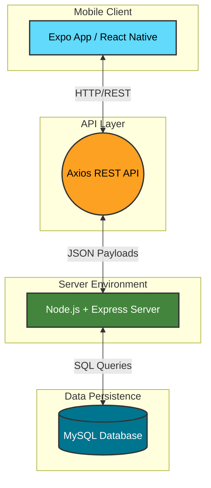

# 🚀 HXNIX - Industrial Social Feed App

[](https://reactnative.dev/)
[](https://expo.dev/)
[](https://nodejs.org/)
[](https://expressjs.com/)
[](https://www.mysql.com/)

HXNIX is a robust, full-stack social feed application designed for seamless high-performance interactions. Built with **React Native (Expo SDK 54)** on the frontend and an efficient **Node.js, Express, and MySQL** architecture on the backend.

---

## ⚡ Access The Grid: Standalone APK (v1.0.3)

| 1. Scan or Click to Download | 2. Installation Guide |
| :---: | :---: |
| <a href="https://expo.dev/artifacts/eas/iWXWVNG9ZvfjQ6QPMAeZoR.apk"></a> |  |
| [**DIRECT DOWNLOAD LINK**](https://expo.dev/artifacts/eas/iWXWVNG9ZvfjQ6QPMAeZoR.apk) | *Make sure to enable "Unknown Sources" in settings* |


> **💡 PRO-TIP:** For the fastest installation, scan the QR code above with your mobile phone's camera. This standalone version requires no local backend setup and connects directly to the production environment.

---

## 🏗️ System Architecture

Our robust client-server model separates frontend view logic from backend data processing.



### Component Breakdown
- **Client App**: Built using React Native functioning under the Expo framework (SDK 54).
- **Network Layer**: Standardized HTTP requests powered by Axios for reliable REST transactions.
- **Server Application**: Utilizing Node.js and Express to swiftly handle routing, validations, and logic (Port 5000).
- **Data Layer**: Secured by MySQL relational database mapping records optimally.

---

## 🛠️ Prerequisites

Ensure you have the following installed on your machine before commencing development:

| Tool | Version | Description |
|------|---------|-------------|
| **Node.js** | 18+ | JavaScript runtime environment |
| **npm** | 9+ | Package manager |
| **MySQL** | 8.0+ | Relational Database Management System |
| **Expo Go** | Latest | Mobile client testing app (SDK 54 compatible) |

---

## 🚀 Quick Start Guide

### 1. Database Initialization
Execute the following SQL command in your MySQL terminal to prepare the data store:
```sql
CREATE DATABASE IF NOT EXISTS hxnix_db
  CHARACTER SET utf8mb4
  COLLATE utf8mb4_unicode_ci;
```
*Note: The backend will automatically create the `posts` table and securely seed it with initial application data upon its first connection if the table is empty.*

### 2. Backend Configuration
Navigate to the `backend` directory, install necessary modules, and begin the server.

```bash
cd backend
npm install
```

Set up your environment variables by checking `backend/.env` (or creating one):
```env
PORT=5000
DB_HOST=localhost
DB_PORT=3306
DB_USER=root
DB_PASSWORD=YOUR_MYSQL_PASSWORD_HERE
DB_NAME=hxnix_db
```

Launch the Node service:
```bash
# Development Mode (Hot Reloading)
npm run dev

# Production Mode
# npm start
```
*Expected Server Logs:*
```text
[DB] MySQL connected successfully
[Model] Posts table seeded with 7 records
Hxnix API running on http://0.0.0.0:5000
```

### 3. Frontend API Configuration
Determine your local network IP (LAN IP):
```bash
# For Windows
ipconfig

# For macOS/Linux
ifconfig
```

Update the configuration file globally located at `frontend/src/config.js` to point to the server:
```javascript
export const API_BASE_URL = 'http://YOUR_LAN_IP:5000';
```
*Important: Devices using Expo Go must connect over the LAN; Localhost mappings will fail for physical devices.*

### 4. Running the Frontend Client
Navigate to the `frontend` folder, retrieve dependencies, and start the application builder:

```bash
cd frontend
npm install
npx expo start --lan -c
```
To run the app:
1. Scan the generated QR code via your terminal with Expo Go (Android) or the native Camera app (iOS).
2. Alternatively, manually input the following URL in Expo Go: `exp://YOUR_LAN_IP:8081`

---

## 🧪 System Verification

To ensure your environment variables and pathways are optimal:

**Check Backend Health via Browser:**
- `http://localhost:5000/health` (Expect: `{"status":"ok", ...}`)
- `http://localhost:5000/api/posts` (Expect: `{"success": true, "data": [...]}`)

---

## 📚 API Reference

| Method | Endpoint | Description |
|:------:|:---------|:------------|
| `GET` | `/health` | Verify server status and latency |
| `GET` | `/api/posts` | Retrieve an array of all posts |
| `GET` | `/api/posts/:id` | Fetch specific data for a single post |
| `POST` | `/api/posts` | Dispatch data to generate a new post |
| `DELETE`| `/api/posts/:id` | Erase a specific post via its parameter ID |

**Example POST Payload:**
```json
{
  "title": "Exploring the Nexus",
  "body": "Detailed content description goes here...",
  "userId": 1
}
```

---

## 🔧 Troubleshooting and Common Fixes

<details>
<summary><strong>1. Database: Access denied for root user</strong></summary><br>

```text
Error: Access denied for user 'root'@'localhost'
```
**Fix:** Validate your `DB_USER` and `DB_PASSWORD` inputs in the `backend/.env` configuration file, and confirm your MySQL background service is operating actively.
</details>

<details>
<summary><strong>2. Unknown database `hxnix_db`</strong></summary><br>

**Fix:** Ensure you have accurately processed the SQL database creation query specified in **Step 1** of the Quick Start Guide.
</details>

<details>
<summary><strong>3. Expo Go incompatible project (SDK mismatch)</strong></summary><br>

**Fix:** Update and align Expo dependencies by conducting the following inside your `frontend` directory:
```bash
npx expo install expo@^54.0.0
npx expo install --fix
```
For deep migrations, consult `SDK54_UPGRADE_README.md`.
</details>

<details>
<summary><strong>4. `Cannot find module 'babel-preset-expo'`</strong></summary><br>

**Fix:** Synchronize the Babel configuration:
```bash
npm install -D babel-preset-expo@~54.0.10
npx expo start --lan -c
```
</details>

<details>
<summary><strong>5. Red spinner or Black screen infinite loop on mobile</strong></summary><br>

**Fix:** 
1. Force close the Expo Go process on your mobile device.
2. Flush the Metro cache forcibly via CLI: `npx expo start --lan -c`
3. Scan the freshly generated QR code.
</details>

<details>
<summary><strong>6. Port 8081 currently in use</strong></summary><br>

**Fix:** Kill any rogue local Node or Expo operations operating on port 8081, or allow Expo to migrate sequentially to port 8082 automatically.
</details>

---

## 📂 Project Structure

```text
hxnix/
├── backend/
│   ├── config/          # DB initialization 
│   ├── controllers/     # API logic processors
│   ├── models/          # DB mapping entities
│   ├── routes/          # Express route definitions
│   ├── .env             # Global backend configurations
│   └── server.js        # Main initialization entrypoint
├── frontend/
│   ├── app/             # Expo File-based Routing pages
│   ├── src/
│   │   ├── components/  # Reusable UI React blocks
│   │   ├── config.js    # Client-side globals
│   │   ├── pages/       # Auxiliary views
│   │   ├── services/    # Data fetching architecture
│   │   └── theme/       # Aesthetics configurations
│   ├── app.json         # Expo Application Settings
│   ├── babel.config.js  # Compiler flags
│   └── package.json     # Client packages & meta
└── SDK54_UPGRADE_README.md
```

---

## 📝 Additional Notes

- **Real-Time Data State:** Removing a post from the feed dynamically updates state upon the subsequent data refresh.
- **Auto-Seeder Resilience:** If all database posts are purged entirely, restarting the backend service will securely execute the seeder process to populate missing primary rows.

<p align="center">
  Built with ❤️ for modern interactive platforms.
</p>
